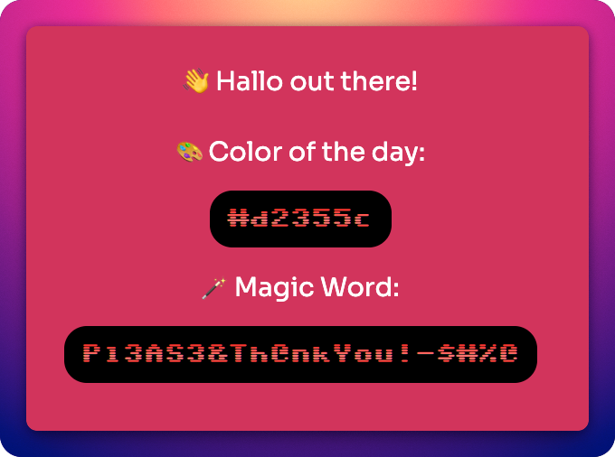

# 😎 Simple App
A simple app that can be deployed for testing in your kubernetes clusters.

## ✅ Recommended Demo Stack (simple + reliable)

- GitHub repo for source + history
- GitHub Actions for CI
- Docker for containerized runtime demo
- GitHub Pages for reliable static deployment demo

## 🧪 Environment Variables

There are currently 3 environment variables for this app:

- `PORT` which defaults to `9000`
- `APP_GREETING` with a default `Hello, World!` this variable tests setting a plaintext value and retrivieing it.
- `MAGIC_WORD` this value would optimally be retrieved from a secret password store. The value is shown plaintext on the web page, but is not intended to secure anything and merely test that retrieval and deployment is working correctly.

For GitHub Pages demos, you can also set:

- `DEMO_COLOR` fixed hex color value (for repeatable screenshots), e.g. `#113355`

## 🚀 Local Run Commands

### 1) Node app (dynamic)

```bash
cd app
npm ci
npm run build
APP_GREETING="Hello DevOps" MAGIC_WORD="ship-it" PORT=9000 npm start
```

Open: `http://localhost:9000`

### 2) Docker app (dynamic)

```bash
docker build -t simple-app-demo .
docker run --rm -p 9000:9000 \
	-e APP_GREETING="Hello from Docker" \
	-e MAGIC_WORD="containerized" \
	simple-app-demo
```

Open: `http://localhost:9000`

### 3) Static GitHub Pages artifact (generated)

```bash
cd app
APP_GREETING="Hello Pages" MAGIC_WORD="published" DEMO_COLOR="#224466" npm run demo:static
open static/index.html
```

## 🤖 GitHub Actions Workflows

- `.github/workflows/ci.yml`
	- Runs on push to `main` and on pull requests
	- Installs deps, builds TypeScript, generates static demo page
- `.github/workflows/deploy-pages.yml`
	- Runs on push to `main` or manual dispatch
	- Generates static page and deploys `app/static` to GitHub Pages

## 🌐 Enable GitHub Pages (one-time)

1. In GitHub repo settings, go to **Pages**.
2. Under **Build and deployment**, set **Source** to **GitHub Actions**.
3. (Optional) Add repository variable `APP_GREETING` and `DEMO_COLOR`.
4. Add repository secret `MAGIC_WORD`.

After the next push to `main`, the Pages URL is published by the workflow.

## 🗣️ Suggested Presentation Demo Script

### Demo A — CI gate in PR

Command:

```bash
git checkout -b demo/ci-change
echo "# demo" >> README.md
git add README.md
git commit -m "docs: trigger CI demo"
git push -u origin demo/ci-change
```

Say while it runs:

> "This commit triggers CI automatically. The pipeline verifies the TypeScript build and static artifact generation before merge."

### Demo B — Container runtime

Command:

```bash
docker build -t simple-app-demo .
docker run --rm -p 9000:9000 -e APP_GREETING="Hello from Docker" -e MAGIC_WORD="runtime-secret" simple-app-demo
```

Say while it runs:

> "Same code, containerized runtime. Env vars are injected at deploy time, which mirrors cluster deployment behavior."

### Demo C — GitHub Pages deployment

Command:

```bash
git checkout main
git pull
git commit --allow-empty -m "chore: trigger pages deploy"
git push
```

Say while it runs:

> "Push to main triggers a deployment workflow that builds a static demo page and publishes it to GitHub Pages for a stable, public demo endpoint."

## 🖥️ Final Product

A final deployed product should produce an HTML page with our greeting, dynamically generated color of the day, and magic word pulled from our secret variable. Of course, your page will vary based on how you choose to set your variables.


